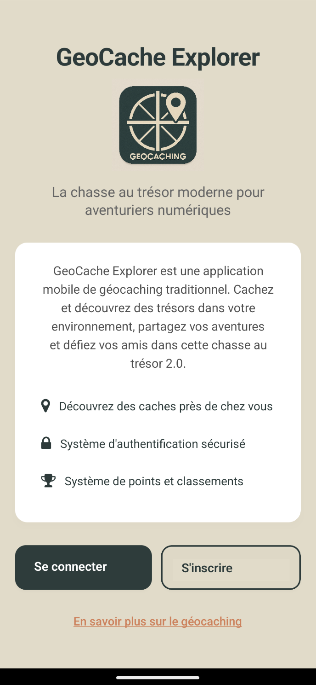
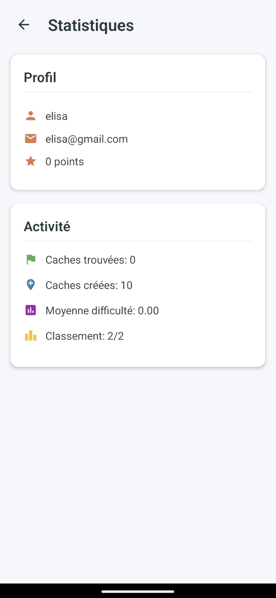

# 🌍 GeoCache - Projet PG219

**Application mobile de géocaching développée avec Node.js, MongoDB et React Native**  

<p align="center">
  
   
  
</p>

L'objectif de ce projet est de proposer une application permettant aux utilisateurs de créer, chercher et découvrir des géocaches. 

## 📌 Fonctionnalités Implémentées

### 🔐 Authentification
- Inscription, connexion, et déconnexion sécurisée avec les jetons JWT (24h de validité)
- Vérification des informations lors de l'inscription (mail valable, pseudo unique, mot de passe un minimum robuste)
- Hachage des mots de passe avec `bcrypt`
- Protection des routes backend par middleware d'authentification 
- Récupération automatique des infos utilisateur à partir du token

### 🗺️ Géocaches
- Attributs des caches : `id`, `latitude`, `longitude`, `creator`, `description`, `difficulty`
- Ajout/modification par le propriétaire uniquement
- Suppression automatique quand un cache est découvert
- Bouton pour ajouter d'un cache à la localisation du joueur 

### 📍 Marqueurs & Cartographie
- Carte interactive avec Leaflet.js dans WebView
- Synchronisation en temps réel avec la base MongoDB
- Localisation du joueur pour afficher les caches à proximité 
- Recentrage de la carte à l'aide d'un des boutons latéraux
- Filtrage par difficulté (1-5 étoiles)

### 📊 Statistiques & Classement
| Difficulté | Points |
|------------|--------|
| ⭐         | 5      |
| ⭐⭐       | 20     |
| ⭐⭐⭐      | 30     | 
| ⭐⭐⭐⭐     | 50     |
| ⭐⭐⭐⭐⭐    | 100    |

- Classement général des joueurs
- Comptage des caches trouvées et créées 
- Moyenne de difficulté personnelle des caches trouvées 

## 🚀 Installation & Lancement

### Prérequis
- Node.js v16+
- MongoDB Atlas ou local
- Expo CLI (pour le client)

### Backend (API)
Nécessite la clé JWT. 
```bash
cd server
npm install     # Installer les packages 
npm start
```

### Frontend (Mobile)
```bash
cd client
npm install     # Installer les packages
npx expo start  # Scanner le QR code avec l'app Expo ou avec Android Studio
```

## Organisation et Architecture 

### Organisation du projet 
```
geocaching
├── README.md
├── client
│   ├── App.js
│   ├── app
│   ├── app.json
│   ├── assets
│   ├── components
│   ├── constants
│   ├── expo-env.d.ts
│   ├── hooks
│   ├── package.json
│   ├── scripts
│   ├── tsconfig.json
│   └── utils
└── server
    ├── config
    ├── controllers
    ├── middlewares
    ├── models
    ├── package.json
    ├── routes
    ├── utils
    ├── package.json
    └── server.js
```

### ⚙️ Stack Technique

| Côté client (mobile) | Côté serveur (API REST) |
|----------------------|--------------------------|
| React Native (Expo)  | Node.js + Express        |
| Leaflet (via WebView) | MongoDB (via Mongoose)  |
| JWT, Axios           | Bcrypt, CORS             |
